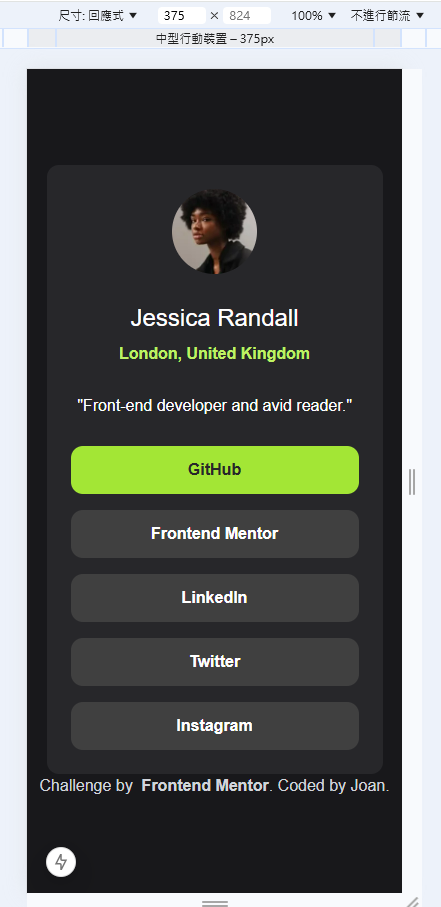
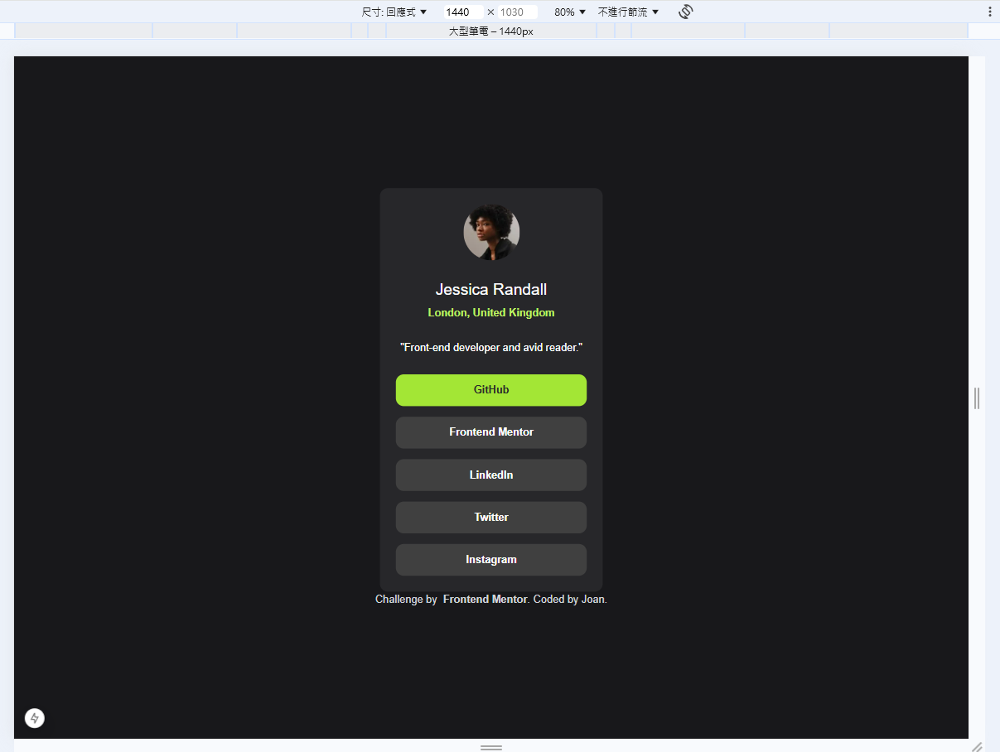

# Frontend Mentor - Social links profile solution

This is a solution to the [Social links profile challenge on Frontend Mentor](https://www.frontendmentor.io/challenges/social-links-profile-UG32l9m6dQ). Frontend Mentor challenges help you improve your coding skills by building realistic projects. 

## Table of contents

- [Overview](#overview)
  - [The challenge](#the-challenge)
  - [Screenshot](#screenshot)
  - [Links](#links)
- [My process](#my-process)
  - [Built with](#built-with)
  - [What I learned](#what-i-learned)
  - [Continued development](#continued-development)
  - [Useful resources](#useful-resources)
- [Author](#author)
- [Acknowledgments](#acknowledgments)

## Overview

### The challenge

Users should be able to:

- See hover and focus states for all interactive elements on the page

### Screenshot

### Links

- Solution URL: https://github.com/joanneast/fm-social-links-profile
- Live Site URL: https://fm-social-links-profile-jet.vercel.app/

## My process

### Built with

- [Next.js]
- [Tailwind CSS]

### What I learned

I'm getting started from Next.js and Tailwind CSS, this practice would help me become more familiar with.
In this project, I tried to visually replicate the color scheme and layout, since the sample doesn't seem like it have RWD, the project didn't include it.
All my frontend knowledge comes from self-study, it might be a bit fragmented.
Therefore, I hope getting more feedback on how my code can be more concise and reasonable!

我目前正在入門 Next.js 和 Tailwind CSS，這個練習幫助我熟悉及記憶他們的架構跟語法。
對於這個練習，我用目測盡量還原它的顏色跟間距，因為範例圖片看起來並沒有 RWD，我並沒有在這個專案中嘗試。
所有我前端的知識，都是從工作中自學的，也許有些零散和碎片化。
因此我希望得到更多的評論，關於我的寫法是否可以更簡潔、或更合理！

### Continued development

Currently, I aim to become more proficient in using RWD and (Tailwind) CSS animations.
My short-term goal in learning these two frontend frameworks is to build my personal website. So I'll continue exploring more flexible, accurate, and perhaps more challenging techniques to showcase on my website!  

目前來說，我預期要將 RWD、(Tailwind) CSS animations 使用得更加純熟。
我學習這兩個前端框架的階段性目的，是建立我的個人網站，所以我會持續嘗試更彈性、正確，也許更困難的技術，以展現在我的網站上！

### Useful resources

- [Tailwind CSS's official teaching class](https://www.youtube.com/watch?v=elgqxmdVms8&list=PL5f_mz_zU5eXWYDXHUDOLBE0scnuJofO0&index=1)

## Author

- Frontend Mentor - [@Joan](https://www.frontendmentor.io/profile/joanneast)

## Acknowledgments

Cause this IS a beginner excercise, I think maybe I just thanks that how cute our dog am ♡

因為這的確是一個初級的練習，我想可能就謝謝我家的狗長得那麼可愛好了♡